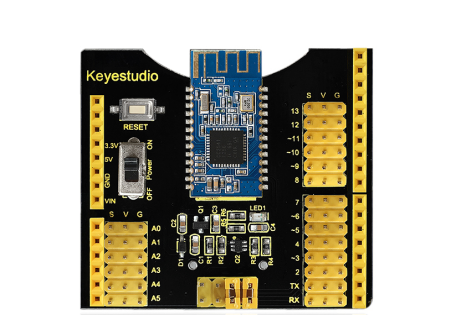
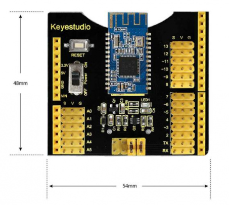
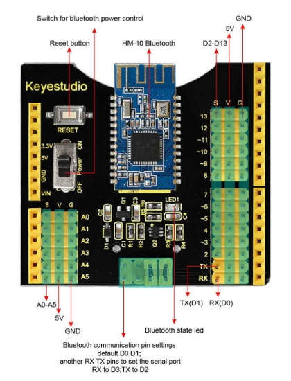
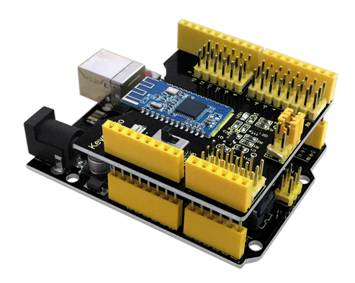
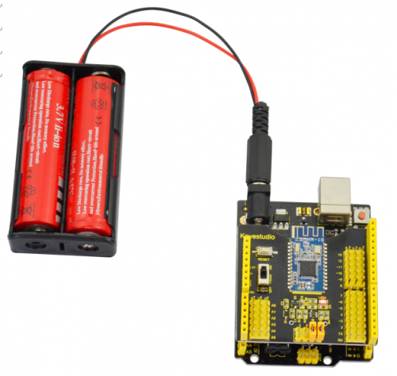
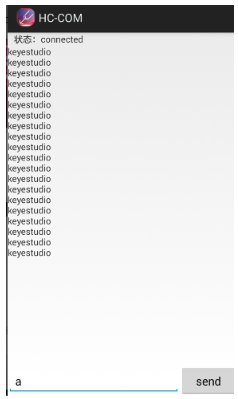

# KS0255 keyestudio Bluetooth 4.0 Expansion Shield

**APP download：** [APP](./APP.7z)



## 1. Introduction

The keyestudio Bluetooth 4.0 shield is an integration of sensor shield and HM-10 Bluetooth-4.0, fully compatible with UNO R3. So it is very easy to stack it onto the UNO R3 board.

The shield has extended all the digital and analog pins out into 3PIN, simple to connect the sensor using 3PIN wire.

It also come with a HM-10 Bluetooth-4.0 used for Bluetooth communication. The slide switch is used to control the power supply for Bluetooth.

Onboard is set with jumper cap, default by communicating the Bluetooth module to UNO R3 serial port. If connect two jumpers, need to set the virtual serial port for UNO R3 board, that is D2 to TX, D3 to RX.

## 2. Features

- Extends 14 digital pins into 3PIN
- Extends 6 analog pins into 3PIN
- Comes with a reset button
- Comes with a slide switch to control the Bluetooth communication
- Comes with jumper interface to control the serial communication pin (default built-in serial port, can select the analog serial port, TX to D2, RX to D3.)
- Comes with a Bluetooth 4.0 module

## 3. Bluetooth 4.0 Parameters

- Terminal block spacing: 3.5mm
- Bluetooth protocol: Bluetooth Specification V4.0 BLE
- No byte limit in serial port Transceiving
- Realize 100m ultra-distance communication with iphone4s in open field.
- USB protocol: USB V2.0
- Working frequency: 2.4GHz ISM band
- Modulation method: GFSK(Gaussian Frequency Shift Keying)
- Transmission power: -23dbm, -6dbm, 0dbm, 6dbm, can be modified by AT command.
- Sensitivity: ≤-84dBm at 0.1% BER
- Transmission rate: Asynchronous: 6K bytes ; Synchronous: 6k Bytes
- Security feature: Authentication and encryption
- Supporting service: Central & Peripheral UUID FFE0, FFE1
- Power consumption: Auto sleep mode, stand by current 400uA~800uA, 8.5mA during the transmission.
- Power supply: 5V DC
- Working temperature: -5 to +65 Centigrade

## 4. Technical Details

- Dimensions: 54mm x 48mm x 23mm
- Weight: 19g



## 5. PINOUT Guide



## 6. Test Code

```c
int val; 
int ledpin=13; 

void setup() 
{ 
  Serial.begin(9600);
  pinMode(ledpin,OUTPUT); 
} 

void loop()
{ 
  val=Serial.read(); 
  if(val=='a')
  { 
	digitalWrite(ledpin,HIGH); 
	delay(250); 
	digitalWrite(ledpin,LOW); 
	delay(250);
 	Serial.println("keyestudio");
  }
}
```

## 7. Example Use

Stack the shield onto keyestudio UNO R3 board, power up and upload the code. Turn on the slide switch to power the HM-10 Bluetooth-4.0.



Then open the APP HC-COM, search device and pair the Bluetooth device. If connected, the LED on the Bluetooth module is normally on.

Enter an “a” on the HC-COM, then click Send, it will display “keyestudio”. Every time sends an “a” , Pin13 LED on the board flashes once.



